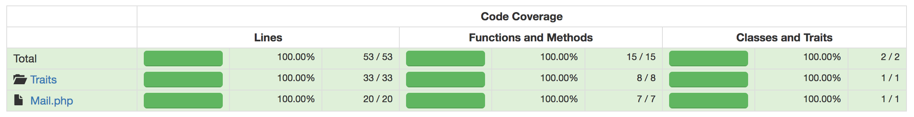

# Mail

A simple emailer class for PHP.

## Dependencies

* PHP7.0+ (would be lower but I've used native type-hinting)
* PHP Composer

## Build

Run `composer install`.

Copy `.env.example` to `.env` and update the settings contained within.

## Usage

I recommend using autoloading so things "Just Work".

```
use App\Mail;

// Here is an example for an HTML email.

$mail = new Mail;

$mail->addTo('jane.doe@example.com', 'Jane Doe');
$mail->setSubject('This is the subject line');
$mail->setHtmlMessage("<h1>Test Message</h1>
<p>Hello world!</p>");

try {
    $mail->send();
} catch (Exception $e) {
    printf("[code %d] Unable to send your email to: %s (%s) - %s",
        $e->getCode(),
        json_encode($mail->getToAddresses()),
        $mail->Subject,
        $e->getMessage()
    );
}
```

An example script can be found [here](script.php).

## Tests

You can run PHPUnit tests: `vendor/bin/phpunit`

A "Lines of code" report is [here](tests/coverage/lines_of_coverage.txt)

## This is CRAP!

Coverage test results, including a CRAP index rating, can be found [here](tests/coverage/).

I keep CRAP index scores _well below_ the accepted target of "30" per class which results in smaller classes, smaller function declarations. Fewer lines of code means less room for bugs and more maintainable code.

The maximum function score is only *3*. There is minimal complexity here :-)



## Built with...

* [PHPStorm](https://www.jetbrains.com/phpstorm/) - _The_ standard PHP IDE.
* [phpcs](https://github.com/squizlabs/PHP_CodeSniffer) - PHPCodeSniffer
* [phploc](https://github.com/sebastianbergmann/phploc) - lines of code report generator
* [FIG-PSR2](https://github.com/php-fig/fig-standards/blob/master/accepted/PSR-2-coding-style-guide.md) - coding standard 
* [Composer](https://getcomposer.org/) - PHP package dependency manager
